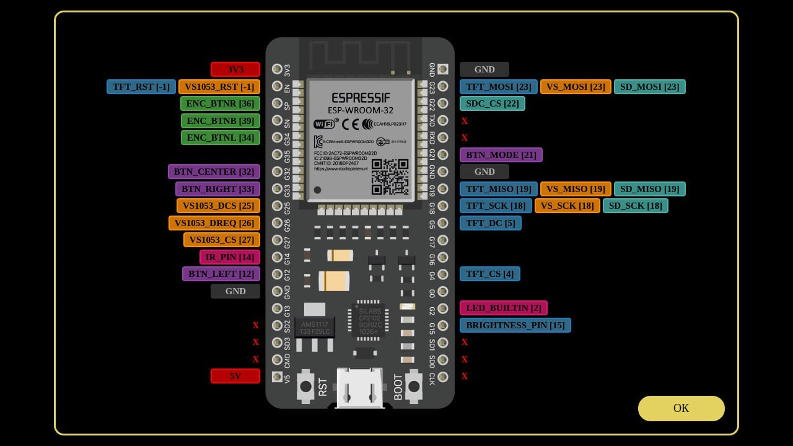

### Разные полезные инструменты, которые помогут вам настроить и прошить [ёRadio](https://github.com/e2002/yoradio)
---
#### 1. ёRadio - [simple myoptions.h generator](https://skrepysh.github.io/RU_yoradio_tools/myoptions-generator.html)

Генератор файла **myoptions.h** для проекта [ёRadio](https://github.com/e2002/yoradio)

Это HTML-файл, который запускается в браузере (chrome, firefox, Opera) или онлайн. После простых действий
при помощи мыши и клавиатуры, на выходе получается конфигурационный файл myoptions.h, полностью готовый к использованию в проекте.
https://skrepysh.github.io/RU_yoradio_tools/myoptions-generator.html

---
